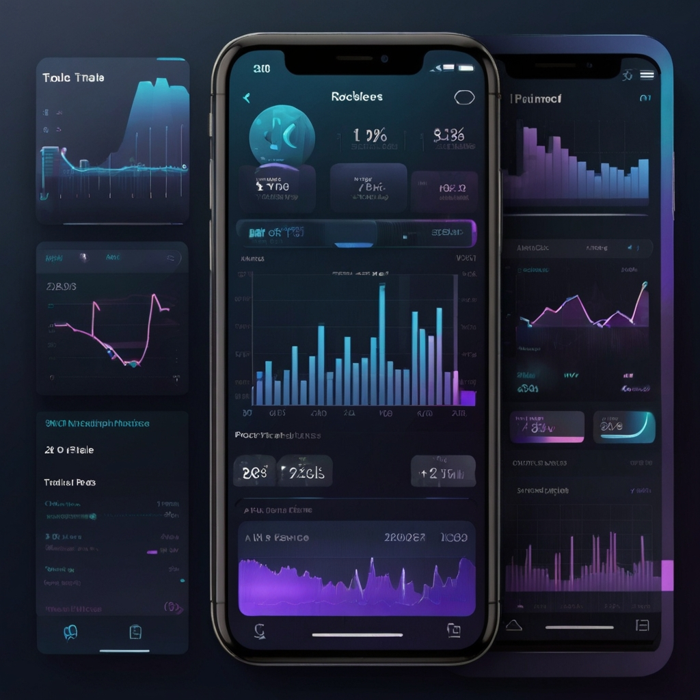

# TRADE PRO ME
<p align="center">
  <a href="https://flutter.dev">
    
  </a>
  <a href="https://dart.dev">
    
  </a>
  <a href="https://github.com/mina2357/Trade-Pro-Stable/releases">
    
  </a>
  <a href="https://github.com/mina2357/Trade-Pro-Stable/blob/main/LICENSE">
    
  </a>
  <a href="https://github.com/mina2357">
    
  </a>
  <a href="https://github.com/mina2357/Trade-Pro-Stable/commits/main">
    
  </a>
  <a href="https://github.com/mina2357/Trade-Pro-Stable/issues">
    
  </a>
  <a href="https://github.com/mina2357/Trade-Pro-Stable/pulls">
    
  </a>
  <a href="https://github.com/mina2357/Trade-Pro-Stable/stargazers">
    
  </a>
</p>
📦 Download version 1.0.0 (initial release): [Trade-Pro-Stable v1.0.0](https://github.com/mina2357/Trade-Pro-Stable/releases/tag/v1.0.0)

📥 Download the latest full release (v1.0.1): [Trade-Pro-Stable v1.0.1](https://github.com/mina2357/Trade-Pro-Stable/releases/tag/v1.0.1)
<p align="center">
  
</p>

## 📦 Download
## 📽️ Project Demo

## 📸 Preview

<p align="center">
  
  
</p>

---

## 🚀 Features

- 🧠 **Smart Dashboard** – Real-time analytics using `fl_chart`.
- 👤 **User Profiles** – Persistent preferences and custom styling.
- 💫 **Modern UI Animations** – Powered by Lottie, Shimmer & AnimatedTextKit.
- 🌍 **API Integration** – Built-in HTTP & data handling via `http`.
- 📂 **Local Data Storage** – Via `shared_preferences` & `path_provider`.
- 🧬 **State Management** – Simplified logic using `provider`.

---

## 🛠️ Tech Stack

| Tech | Usage |
|------|-------|
| 🛠️ **Flutter** | Mobile SDK |
| 💻 **Dart** | Main language |
| 🧱 **Provider** | State management |
| 📈 **Fl Chart** | Graphical charting |
| 💡 **Lottie / Shimmer** | Modern animations |
| 💾 **Shared Preferences** | Lightweight storage |
| 🌐 **HTTP & UUID** | API + identifiers |

---
## 🎓 Certification

This project has been officially certified.  
📄 [View full certificate](./CERTIFICATE.md)

---
## 📜 License

This project is protected under a **custom proprietary license**.  
Unauthorized use is prohibited.  
To use, modify, or share this project, you must first get permission from the author.  
If granted, you must give proper credit to **Mina Ernest Kamal Mikhail** and link to this repository.

## 📁 Project Structure

```bash
lib/
├── main.dart
├── dashboard_page.dart
├── profile_page.dart
├── certificate_widget.dart
├── pulse_widget.dart
├── trading_service.dart
├── trading_widgets.dart
├── theme.dart

